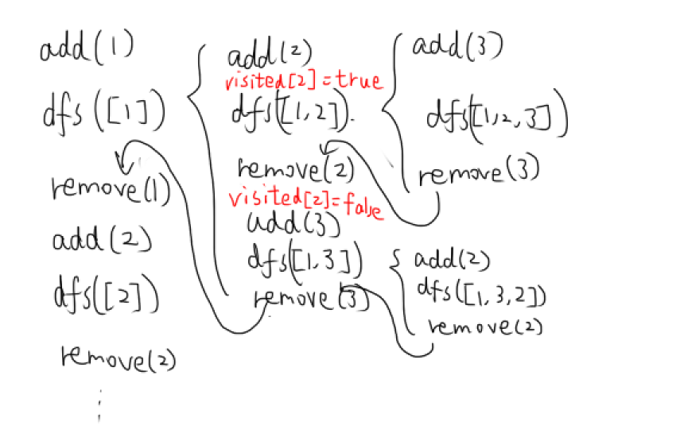

##### 46.全排列

首先，为了避免重复元素，需要visited数组标记

其次，由于每个解长度相同，所以每次for循环从0开始

```java
class Solution {
    boolean[] visited=new boolean[7];//避免重复访问
    void dfs(int[] nums,List<List<Integer>>res,List<Integer>current){
        int n=nums.length;
        if(current.size()==n){
            res.add(new ArrayList<>(current));//java中一定要新建一个数组，否则跟随原来的变化
            return;//return只是表明此次dfs结束，但程序的栈中还存在父dfs函数，继续执行
        }
        for(int i=0;i<n;++i){
            if(visited[i]==false){
                current.add(nums[i]);
                visited[i]=true;
                dfs(nums,res,current);
                current.remove(current.size()-1);
                visited[i]=false;
            }
        }
    }
    public List<List<Integer>> permute(int[] nums) {
        List<List<Integer>>res=new ArrayList<>();
        dfs(nums,res,new ArrayList<Integer>());
        return res;
    }
}
```
回溯的关键就是知道dfs函数每趟结束后回到哪继续执行，例如dfs([1,2])->add(3)->dfs([1,2,3])->remove(3)->remove(2)->add(3)->dfs([1,3])



##### 78.子集

要求计算所有子集。这是回溯的第二种类型，即dfs参数包括一个start位置，作为for循环的起始位置。这样使得**1的子树>2的子树>3的子树**，保证了集合间不重复（如[1,2,3],[1,3,2]）

由于每次start都会递增，相当于肯定取不到之前的位置，所以不需要多余的visited数组了

```python
def dfs(nums,res:List[List[int]],now:List[int],start:int):
    res.append(now[:])# 不能直接加入now，否则只是引用，里面最后为空
    for i in range(start,len(nums)):
        now.append(nums[i])
        dfs(nums,res,now,i+1)
        now.pop()

class Solution:
    def subsets(self, nums: List[int]) -> List[List[int]]:
        res=[]
        now=[]
        dfs(nums,res,now,0)
        return res
```

##### 77.组合

对于c++，由于vector难以在堆中创建，需要写成全局变量，返回才不为空

```cpp
class Solution {
public:
    vector<vector<int>>res;
    vector<int>now;
    void dfs(int n,int k,int start){
        if(now.size()==k){
            res.push_back(now);
            return;
        }
        for(int i=start;i<=n;++i){
            now.push_back(i);
            dfs(n,k,i+1);
            now.pop_back();
        }
    }
    vector<vector<int>> combine(int n, int k) {
        dfs(n,k,1);
        return res;
    }
};
```

